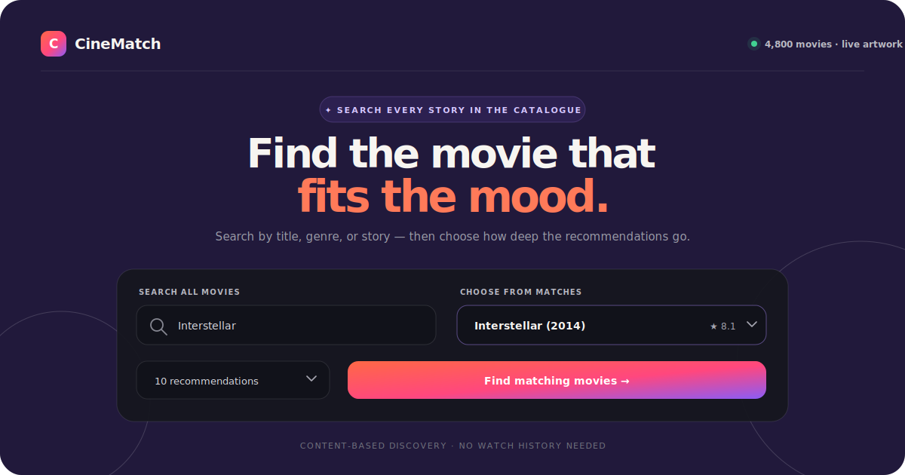
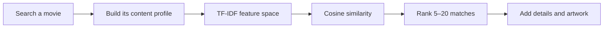

<div align="center">



<br />

[](https://cinematch-preview.jhanupur18.chatgpt.site)
[](#the-experience)
[](#how-cinematch-thinks)

### A cinematic, story-first movie discovery experience.

Search the complete catalogue by title, genre, or story. Pick a film you love, and CineMatch finds the movies that share its creative DNA.

</div>

---

## The experience

<table>
  <tr>
    <td width="33%" valign="top">
      <h3>🔎 Search every story</h3>
      <p>Explore all <strong>4,800 unique movies</strong> by title, original title, genre, keywords, or overview—not a small curated subset.</p>
    </td>
    <td width="33%" valign="top">
      <h3>✦ Match the mood</h3>
      <p>Choose <strong>5, 10, 15, or 20</strong> ranked recommendations based on themes, cast, crew, genres, and story similarity.</p>
    </td>
    <td width="33%" valign="top">
      <h3>🎞️ See the cinema</h3>
      <p>Rich selected-movie banners, high-resolution poster cards, ratings, runtime, genres, match scores, and resilient local artwork.</p>
    </td>
  </tr>
</table>

<div align="center">

| 4,800 | 5–20 | 100% local engine | Optional TMDB art |
|:---:|:---:|:---:|:---:|
| searchable movies | recommendations | no watch history | posters + backdrops |

</div>

## How CineMatch thinks



The recommendation engine builds a sparse TF-IDF index from each movie's overview, genres, keywords, cast, and director. Similarity is calculated only when you search, avoiding a large committed `similarity.pkl` while keeping the bundled catalogue fully usable offline.

## Built for movie night

- **Complete discovery** — title, original-title, genre, keyword, and story search.
- **Cinematic selection banner** — year, rating, runtime, genre chips, tagline, and overview.
- **Ranked poster grid** — clear match percentage and movie metadata on every result.
- **Smart artwork recovery** — TMDB ID lookup followed by title/year fallback.
- **Graceful local mode** — attractive deterministic title art when no TMDB token is set.
- **Fast repeat browsing** — sparse vectors, cached data, and concurrent artwork requests.
- **Responsive UI** — polished layouts for desktop, tablet, and mobile.
- **Secure by design** — credentials stay in Streamlit secrets or environment variables.

## Run it locally

```bash
git clone https://github.com/prithvicoder1/Movie-Recommender-System.git
cd Movie-Recommender-System

python -m venv .venv
source .venv/bin/activate            # Windows: .venv\Scripts\activate
pip install -r requirements.txt
streamlit run app.py
```

Open **http://localhost:8501**. Search and recommendations work immediately—no external API is required.

## Enable cinematic artwork

Create a free credential in [TMDB account settings](https://www.themoviedb.org/settings/api), then copy the safe example file:

```bash
cp .streamlit/secrets.toml.example .streamlit/secrets.toml
```

Add your read-access token to the untracked secrets file:

```toml
TMDB_BEARER_TOKEN = "your_read_access_token"
```

You can also use an environment variable:

```bash
export TMDB_BEARER_TOKEN="your_read_access_token"
streamlit run app.py
```

> [!IMPORTANT]
> Never commit a real TMDB credential. `.streamlit/secrets.toml` and `.env` are already ignored. For Streamlit Community Cloud, add `TMDB_BEARER_TOKEN` under **Settings → Secrets** and reboot the app.

## Inside the project

```text
Movie-Recommender-System/
├── .streamlit/
│   ├── config.toml                 # CineMatch dark theme
│   └── secrets.toml.example        # Safe credential template
├── assets/
│   └── cinematch-hero.svg          # README product artwork
├── cinematch/
│   ├── artwork.py                  # Posters, backdrops, and fallbacks
│   ├── catalogue.py                # Catalogue loading and full search
│   ├── presentation.py             # Safe movie-card presentation
│   ├── recommender.py              # Sparse TF-IDF ranking
│   └── styles.py                   # Responsive visual system
├── tests/
│   ├── test_artwork.py
│   └── test_catalogue.py
├── app.py                          # Streamlit page composition
├── movie_list.pkl                  # 4,800 processed movie profiles
├── tmdb_5000_movies.csv            # Local ratings and metadata
├── generate_model.py               # Optional catalogue regeneration
├── requirements.txt
└── Dockerfile
```

## Quality checks

```bash
python -m unittest discover -s tests -v
```

The regression suite covers the 4,800-title catalogue, full search behavior, stable movie selection, 20-result recommendation depth, and poster/backdrop fallback logic without live network requests.

<details>
<summary><strong>Run with Docker</strong></summary>

```bash
docker build -t cinematch .
docker run --rm -p 8501:8501 cinematch
```

With TMDB artwork enabled:

```bash
docker run --rm -p 8501:8501 \
  -e TMDB_BEARER_TOKEN="your_read_access_token" \
  cinematch
```

</details>

---

<div align="center">

### Built for curious movie nights.

[**Open the live experience →**](https://cinematch-preview.jhanupur18.chatgpt.site)

<sub>Python · Streamlit · pandas · scikit-learn · TMDB</sub>

<br /><br />

<sub>This product uses the TMDB API but is not endorsed or certified by TMDB.</sub>

</div>
